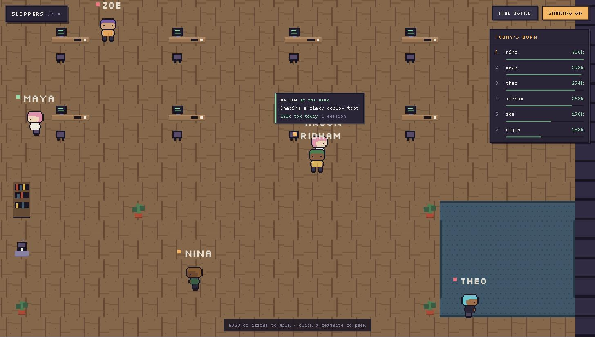

# sloppers

A pixel office where your team's coding agents show up for work.

Everyone walks around a shared office in the browser. Each avatar carries a
live status derived from the coding-agent sessions — Claude Code, Codex CLI —
running on that person's machine: what they're building, which model, whether
the agents are grinding or blocked waiting for a human, and how many tokens
they've burned today. Walk up to someone to see what their machine is up to.



## Why

Teams that run coding agents all day have a new kind of presence: half the
"work" happening at any moment is machines cooking while humans think, review,
or sleep. sloppers makes that visible and a little bit social — ambient
awareness of who's deep in something, whose agent needs input, and a friendly
daily scoreboard for the tokenmaxers.

- **Join is browser-only.** A URL, an invite code, a name, a face. Nothing to
  install to walk around.
- **Sharing is one paste, once.** The office mints you a command like
  `npx sloppers share K4X-P2Q@your-office.dev`; run it on the machine where
  your agents live and your avatar is live from then on (auto-start included).
- **Privacy is enforced at the source.** The collector reads local session
  files and sends only derived status — project, branch, model, state, token
  counts, a session title. Never prompts, code, or file contents. Every field
  can be hidden (`sloppers hide tokens`), sharing can be paused
  (`sloppers pause`), and the collector is ~2k lines of readable TypeScript
  you can audit.

## Presence at a glance

| state | meaning |
| --- | --- |
| 🟢 active | human at the desk, agents working |
| 🟠 grinding | agents working, human away — the machines are cooking |
| 🔴 needs attention | an agent is blocked waiting on its human |
| ⚪ afk / offline | quiet |

## Run your own office

One process, one SQLite file. With Docker:

```sh
git clone https://github.com/Rythm18/sloppers && cd sloppers
docker compose up --build
# open http://localhost:8787
```

Or from source (Node ≥ 20, pnpm):

```sh
pnpm install
pnpm build
node packages/server/dist/main.js            # http://localhost:8787
```

Demo mode adds a `demo` room full of simulated teammates — useful for trying
the thing without three friends online. From source, pass `--demo`; in
Docker, set the `SLOPPERS_DEMO=1` environment variable:

```sh
node packages/server/dist/main.js --demo
# open http://localhost:8787/?room=demo
```

Environment: `PORT` (default 8787), `DATA_DIR` (default `./data`), `WEB_DIST`
(defaults to the sibling web build).

## Share your agents

From inside the office, click **Share agents** and paste the command it gives
you into a terminal on your dev machine. That's it — the collector watches
`~/.claude/projects` and `~/.codex/sessions` via filesystem events, installs
itself as a launchd/systemd user service, and reconnects on its own.

Useful commands afterwards:

```sh
sloppers status        # what's being shared right now
sloppers pause         # stop broadcasting (stays paired)
sloppers hide tokens   # per-field visibility: title|project|branch|model|tokens
sloppers uninstall     # remove auto-start
```

> Until the `sloppers` package is published to npm, run the collector from a
> checkout instead: `node packages/collector/dist/cli.js share <code>`.

## How it works

```
dev machine                        server                       browsers
~/.claude, ~/.codex ──fs events──▸ collector ──ws──▸ rooms ──ws──▸ office
(read locally, filtered locally)             presence · token ledger · leaderboard
```

Three parts, one wire contract ([`packages/protocol`](packages/protocol)):
the collector daemon, a single-process server (Hono + ws + SQLite), and the
office web app (Phaser 3 + React). Full design notes in
[docs/ARCHITECTURE.md](docs/ARCHITECTURE.md).

All the pixel art is original and generated at build time by
[a script](packages/web/scripts/gen-assets.mjs) — no asset packs, no license
strings attached.

## Add your harness

Claude Code and Codex CLI are built in. An adapter is one small file that
teaches the collector to read another harness's on-disk session format —
Gemini CLI, opencode, aider, whatever you run. See
[CONTRIBUTING.md](CONTRIBUTING.md#writing-a-harness-adapter).

## Development

```sh
pnpm install
pnpm build          # protocol → collector/server → web
pnpm test           # unit + integration + headless e2e
pnpm lint           # biome
pnpm demo           # build and serve a demo office
```

## License

[MIT](LICENSE)
